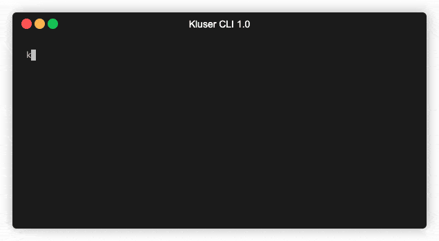

# Documentation

## Prerequisites

- Basic familiarity with HTML & CSS.
- Node.js and npm installed globally.

## Setup and Installation

Globally install kluser in your system.

```sh
$ npm install -g kluser
```

In a React or React Native project, use the command below to generate the local configuration files of your project.

```sh
$ kluser
```

- Use the keyboard arrows to choose between React or React Native as output and press ENTER.
- Add the desired features pressing SPACE and ENTER to continue.
- Select the default folder where the components and pages will be generated (default: 'src').
- Choose whether you want to generate a Build or enter the Live Preview mode to see the default structure being generated inside the default folder.



Note that a folder named Kluser was created within your current directory.

```sh
kluser
├── .kluser.json
├── index.html
└── style.css
```

#### _.kluser.json_

Contains the project settings

#### _index.html_

File for tag creation

#### _style.css_

File for styles editing (within index.html Other style files can be created)
